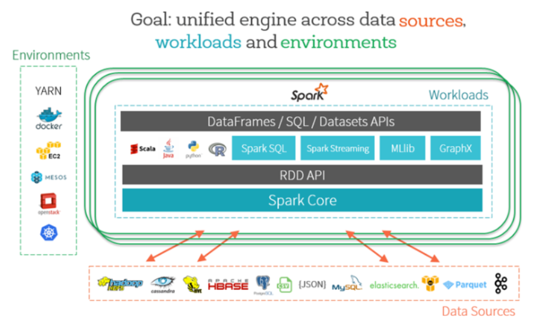
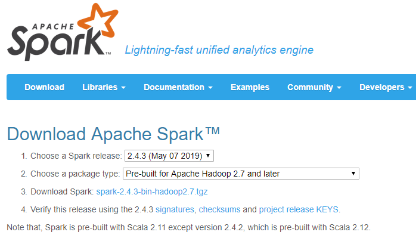
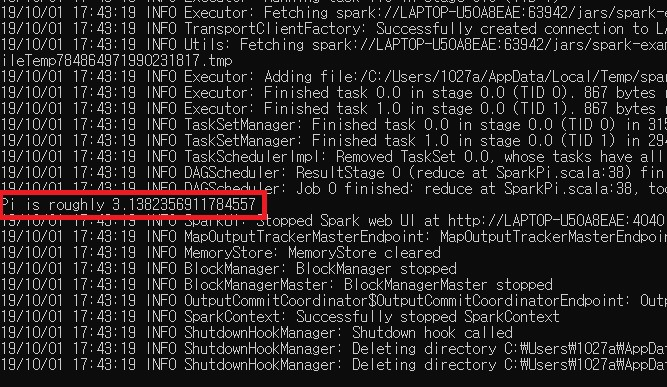
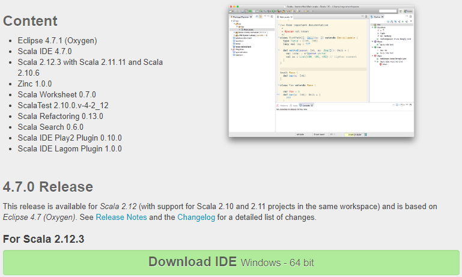

# 1. what is Apache Spark
Apache Spark is a high-speed clustered computing technology designed for fast calculation. Apache Spark is the MapReduce base of Apache Hadoop and has also been developed to expand MapReduce to be used efficiently for more types of calculations, such as interactive queries and stream processing. The key feature of Apache Spark is its in-memory cluster computing.



# 2. Setup

We strongly recommend you update your installation to the must recent version of Spark. As of Aug 2019 we used Spark 2.4.3 and Hadoop bin 2.7.

If you want to use another version there, all you have to do is to locate your installation directories for Spark and Hadoop, and use that in the next section 2.1 for setting up your environment.

## 2.1. Installing Spark+Hadoop on Linux

1\. Go to [Apache Spark Download page](http://spark.apache.org/downloads.html). Choose the Spark release (2.4.3), and the package type "Pre-built for Hadoop 2.7 and later". Click on the link "Download Spark" to get the `tgz` package of the 2.4.3 Spark release. On Aug 2019 this file was `spark-2.4.3-bin-hadoop2.7.tgz` so we will be using that in the rest of these guidelines but feel free to adapt to your version.

```
wget https://archive.apache.org/dist/spark/spark-2.4.3/spark-2.4.3-bin-hadoop2.7.tgz
```

> 

2\. Uncompress that file into `/usr/local` by typing:

```
sudo tar xvzf spark-2.4.3-bin-hadoop2.7.tgz -C /usr/local/
```

3\. Create a shorter symlink of the directory that was just created using:

```
sudo ln -s /usr/local/spark-2.4.3-bin-hadoop2.7 /usr/local/spark
```

## 2.2. Installing Spark+Hadoop on Windows

1\. Go to [Apache Spark Download page](http://spark.apache.org/downloads.html). Choose the Spark release (2.4.3), and the package type "Pre-built for Hadoop 2.7 and later". Click on the link "Download Spark" to get the `tgz` package of the 2.4.3 Spark release. On Aug 2019 this file was `spark-2.4.3-bin-hadoop2.7.tgz` so we will be using that in the rest of these guidelines but feel free to adapt to your version.

```
// Click on the link below to download.
https://archive.apache.org/dist/spark/spark-2.4.3/spark-2.4.3-bin-hadoop2.7.tgz
```
2. unZip it.

# 3. How to run Spark scripts

## 3.1. Run Spark scripts on Linux
```
cd /usr/local/spark/bin 
./spark-submit --class org.apache.spark.examples.SparkPi ../examples/jars/spark-examples_2.11-2.4.3.jar
```

## 3.2. Run Spark scripts on Windows
```
// Run in Window Command.
// go to the /spark/bin file
spark-submit.cmd --class org.apache.spark.examples.SparkPi ../examples/jars/spark-examples_2.11-2.4.3.jar 
```

Then you can see the results of the picture below.
> 

# 4. Scala IDE
The aim of Scala IDE is to provide a support for Scala development equivalent to the support provided by Eclipse for Java development.

1\. Go to [Scala IDE Download page](http://http://scala-ide.org/download/sdk.html). Choose the release (4.7.0). Click on the link "Download IDE" to get the `tgz.gz` package of the latest IDE release. On Aug 2019 this file was `scala-SDK-4.7.0-vfinal-2.12-linux.gtk.x86_64.tar.gz` so we will be using that in the rest of these guidelines but feel free to adapt to your version.

```
wget downloads.typesafe.com/scalaide-pack/4.7.0-vfinal-oxygen-212-20170929/scala-SDK-4.7.0-vfinal-2.12-linux.gtk.x86_64.tar.gz
```

2\. Uncompress that file into `/usr/local` by typing:

```
sudo tar xvzf scala-SDK-4.7.0-vfinal-2.12-linux.gtk.x86_64.tar.gz -C /usr/local/
```

3\. To run Scala IDE

```
/usr/local/eclipse/eclipse
```

> 

